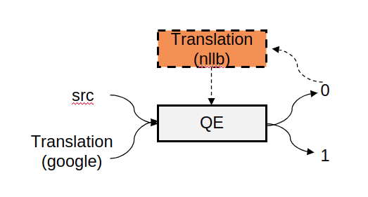
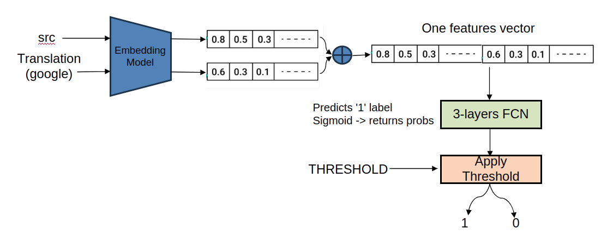

# QE Classifier

## **Introduction:**

QE = Quality Estimator

A pipeline that gets pairs of sentences (source-translation) and determine the quality
of the translation by class:
* '0' - bad translation
* '1' - good (enough) translation

At the base of this pipeline lies our trained QE Classifier.

Another feature this pipeline allows us is to replace bad translation with alternative options from another non-google models.

## **Detailed Description:**

The pipe is as follows:



Zoom in on the QE architecture:




## **Usages: 🖥️**

### **1. Training**

run this script: [train_embeddings_qe.py](train_embeddings_qe.py)

This script gets the data and train several times a fully-connected network, each time called 'trial' and they differ
from each other by the hyperparameters.
We use the <u>optuna</u> package to define trial's objective and each trial we randomly select hyperparameters like
size of hidden dimensions, learning rate, and batch size. We do 10 trials and track the accuracy, precision and recall.

All those trials are saved, and in the end we can see which trials are maximizing those metrics (accuracy, precision and recall).

The models are saved by SAVE_INTERVAL parameter.

The required arguments as inputs are:
* xsts_data_file - csv file containing all the necessary data - src sentences, translations (Google), ranks from human annotator.

```bash
python3 train_embeddings_qe.py data/pass-or-not_ranks_evals.csv --output_dir runs --val_split 0.2 --epochs 100 --save_interval 20
```

---

### QE Config ⚙️

The next scripts for evaluation, prediction and data enrichment are required a config file as input.

All the models and other important parameters are define in the config file.

An example: [qe_config_example.yaml](Configs/qe_config_example.yaml)

Some parameters in the config file like 'qe_model_path' and 'HIDDEN_DIMS' depend on the chosen QE model.

---

### **2. Eval**

run this script: [qe_eval.py](qe_eval.py)

The required arguments as inputs are:
* config_file - path to the config file for the QE and alternative translation model.
* xsts_data_file - csv file containing all the necessary data - src sentences, translations (Google), ranks from human annotator.
* output_dir - The output dir to save the plots. Current directory by default.

```bash
python3 qe_eval.py Configs/qe_config.yaml data/pass-or-not_ranks_evals.csv runs/Eval/GT=google_rank2 --gt google_rank2
```

---
### **3. Use case 1 - get QE predictions**

* To get only the predictions and save them to text file - run this script: [qe_run.py](qe_run.py)

    This script gets as input 2 text files (source and target) and return predictions
    (0 or 1) for each pair of sentences.

    The arguments this script required are:
    * config_file -  path to the config file for the QE and alternative translation model.
    * src_file - File containing the source data.
    * trans_file - File containing the target data.
    * output_dir - The output dir to save the predictions in. Current directory by default.

```bash
python3 qe_run.py Configs/qe_config.yaml data/src.txt data/trans.txt --batch_size 50
```
  
* To filter a file (source sentences or translations) based on those predictions - run this script: [filter_file.py](filter_file.py)

---
### **4. Use case 2 - filter and enrich**

run this script: [data_enrichment.py](data_enrichment.py)

This script filter the data (by given mask file or get the QE predictions itself if not given),
and trying to replace bad translations with another ones following the pipeline described above.

If the alternative translation model is not set properly in the config file, it's just deleting the bad translations,
basically filtering the src and trans files.


```bash
python3 data_enrichment.py Configs/qe_config.yaml data/src.txt data/trans.txt --batch_size 50 --mask_file qe_preds.txt
```

---
## **Performance: **

To see the QE's model performance on the test dataset (700 samples) - go to [best_models directory](best_models)
