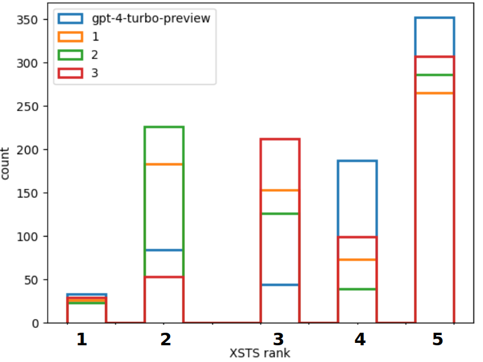
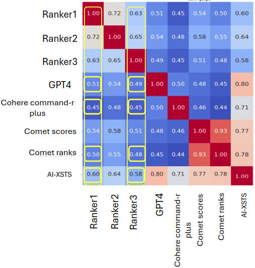

# AI-XSTS

An automated MT evaluation system eliminating the need for human rankings.

This evaluation is based on the XSTS (Cross-Lingual Semantic Textual Similarity) method for cross-lingual translation evaluation, where a human typically rates a translation against a given source sentence on a scale from 1 to 5.

The rating methodology:
* 5 = Exactly and completely equivalent in meaning and expression. 
* 4 = Near-equivalent meanings with only minor differences in expression. 
* 3 = Mostly equivalent, with some unimportant details differing. 
* 2 = Some shared details but not equivalent in important aspects. 
* 1 = Not equivalent, sharing very little details or about different topics.

You can find an explanation of the ranking method here: [XSTS_survey.pdf](../../assets/XSTS_survey.pdf).

Ratings examples:

| Text 1                                                     | Text 2                                         | Rating |
|------------------------------------------------------------|------------------------------------------------|--------|
| لا لا لا ما بدنا انتعب الحجة                                | לא, לא, לא, אנחנו לא רוצים למצות את הטיעון     | 1      |
| يعني اللّي بخشّ فيها الأزمة بطلع بكرة العصر.               | כלומר, מי שחושש מהמשבר ייצא מוקדם אחר הצהריים. | 2      |
| يزن حبيبي مش معقول شو كبران                               | יאזן, יקירתי, לא ייאמן כמה הוא גדל             | 3      |
| ولازم كمان تزور المطاعم القديمة زي هاشم.                  | צריך לבקר גם במסעדות ותיקות כמו האשם.          | 4      |
| وشو بالنسبة للطيارة والمطار يا أم إنصاف؟                   | מה עם המטוס ושדה התעופה, אום אנסף?             | 5      |


The problem with human annotation is that it is slow and costly. Our method utilizes LLMs to perform the same task.

---
## **Performance:**

| Rankings distribution                                         | AIXSTS's Correlation to the other rankers       |
|---------------------------------------------------------------|-------------------------------------------------|
|  |  |

As you can see, the automatic AI-XSTS ranker got high correlation to the other rankers,
almost similar to the correlation between themselves.

---

## **Setup:**

1. Create an `.env` file. See [.env_example](.env_example) as an example. This file must contain a valid OpenRouter API key.
2. Ensure that [llms2use.py](Configs/llms2use.py) includes all the LLM models you want to use for evaluating your translation against Google.

---

## **Usage Section: 🖥️**

1. To generate a XSTS form for human annotators based on the given data - run the script: [build_xsts_form.py](build_xsts_form.py).
    
    * Creates 2 csv files in 'XSTS_forms' dir -
      1. <u>xsts_form.csv</u> - a form that is forwarded to human annotators for blind evaluation.

            | Sentence                                                                                      | Candidate 1                                                                                  | Rank 1 | Candidate 2                                                                         | Rank 2 |
            |------------------------------------------------------------------------------------------------|---------------------------------------------------------------------------------------------|--------|------------------------------------------------------------------------------------|--------|
            | بكرة رح تسمعوا ٩٩% من شوفيريّة التّكاسي باعين التّكاسي ونازلين يشتغلوا عمّال بالدّاخل. عشان مين؟ عشان محمّد اشتية يكرم على حسابهم. | מחר תשמעו 99% מהנהגים של המוניות עם שתי מוניות שיוצאות לעבוד ב”פְּנים”. בשביל מי? בשביל שמוחמד אשתיה יכובד על חשבון עצמם. |        | מחר תשמעו ש-99% מנהגי המוניות מחפשים מוניות ויוצאים לעבוד כעובדים בפנים. בגלל מי? כי מכבדים את מוחמד שתייה על חשבונם. |        |
            | شايف لك هالرجال أبو الحنية هنيك ‎؟                                                           | אתה רואה את האנשים האלה, אבו אל-הניה, שם?                                                 |        | אתה רואה את האיש הזה אבו אלחניה שם?                                              |        |
            | ‏ما عملت گاتو بحياتي ‎                                                                        | מעולם לא עשיתי קאטו בחיים שלי                                                              |        | אף פעם לא עשיתי כלום עם החיים שלי                                                 |        |
            | كلّ الاحترام للنّاس المحترمين ولتعليقاتهم المحترمة مثلهم.                                      | כל הכבוד לאנשים המכובדים ולתגובות המכובדות שלהם, כמותם.                                    |        | כל הכבוד לאנשים מכובדים והערותיהם המכבדות באותה מידה.                             |        |
            | أخيرًا ألف ألف ألف مبروك للرّاسبين، لأنّه فعلًا الرّاسبين هم إللّي ماسكين البلد.               | לבסוף, אלף אלף אלף ברכות למצליחים, כי באמת הנכשלים הם אלו ששומרים על העיר.                |        | לבסוף, אלף אלף ברכות למי שנכשל, כי באמת הכשלים הם העניים במדינה.                 |        |

            Here 'candidate1' ond 'candidate2' are translations from Google and from our model, randomly shuffled
                so the annotator won't know which is which.
      2. <u>xsts_metadata.csv</u> - a file that contains additional metadata, like which model is 'candidate1',
      which one is 'candidate2', their AI-XSTS scores, and the association with certain use-cases. 
    * Save a plot shows the distribution of different use-cases in the XSTS form that has been created.
        Use-cases like:
  
      * how many times our model outperformed Google.
      * how many times our model outperformed Google, but they both have low scores.
      * how many times our model outperformed Google by a large margin.
      * etc.


2. For start-to-end evaluation - run the script: [eval.py](eval.py).

   This script encompasses all stages of the process, providing a flexible framework for evaluation.

### **We'll focus on the evaluation script.**

### **Script Arguments:**

- `--config_file` (type: `str`, required: `True`): Path to a config file (could be either json or yaml).
- `--run_google` (action: `store_true`): Specify whether to run AI-XSTS on the Google file as well.
- `--run_aixsts` (action: `store_true`): Specify whether to run AI-XSTS evaluation.
- `--no_comet_score` (action: `store_true`): Specify whether to calculate COMET scores. By default, COMET scores and ranks are calculated.
- `--start_index` (type: `int`, default: `0`): The index of the row to start from (useful if the process is stopped mid-way).
- `--stop_index` (type: `int`, default: `None`): The index of the row to stop at (useful if you want to stop mid-way).

### **Configuration File:**

The configuration file is a critical argument. It determines which files to use as sources and translations, and where to save all results. Refer to [config_example.json](Configs/config_example.json) as an example.

Not all fields need to be filled. The required ones are the paths to the different sentences:

- `src_path`
- `ref_path`
- `trans_res_path`
- `google_res_path`

Other fields have default values.

Explanation on the other fields in the config file:
- `comet2ranks_model_path` - path to a classification model trained to convert COMET scores to ranks (in range 1-5).
    You can use [comet_ranking_model.py](comet_ranking_model.py) to train your own model.

- `llm_output_path` - where to save the outputs of the LLMS.

    one file for LLM X 2 (outputs for 'google' or 'model' translations)
- `ai_xsts_outputh_path` - where to save the overall AI-XSTS outputs.
- `comet_outputh_path` - where to save the COMET scores and COMET ranks.
- `vis_result_eval` - where to save the plots.

### **Default Behaviors:**

- By default, only evaluation based on COMET scores is run. Use `--no_comet_score` to disable this option.
- By default, AI-XSTS evaluation (which is costly) is not run. Use `--run_aixsts` to enable it.
- When running AI-XSTS, running it on Google translations every time is unnecessary because they do not change from evaluation to evaluation. To run AI-XSTS on Google translations, use `--run_google`.
- If the AI-XSTS results file for Google does not exist, AI-XSTS will be run on Google translations regardless of whether `--run_google` is specified.
- The `start_index` and `stop_index` arguments help control the data processed.

---

### **Examples:**

1. Run the script based on the default config file, only plotting results for COMET:

    ```bash
    python3 eval.py
    ```

2. Run the script and calculate AI-XSTS rankings as well (for our model and for Google):

    ```bash
    python3 eval.py --config_file config.json --run_aixsts --run_google
    ```

3. Run the script without calculating COMET scores and without AI-XSTS on Google translations (their rankings already exist):

    ```bash
    python3 eval.py --config_file config.json --run_aixsts --no_comet_score
    ```

4. Run the script only on part of the data:

    ```bash
    python3 eval.py --config_file config.json --run_aixsts --run_google --start_index 100 --stop_index 1000
    ```

---
